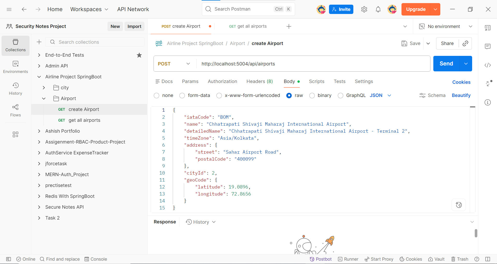
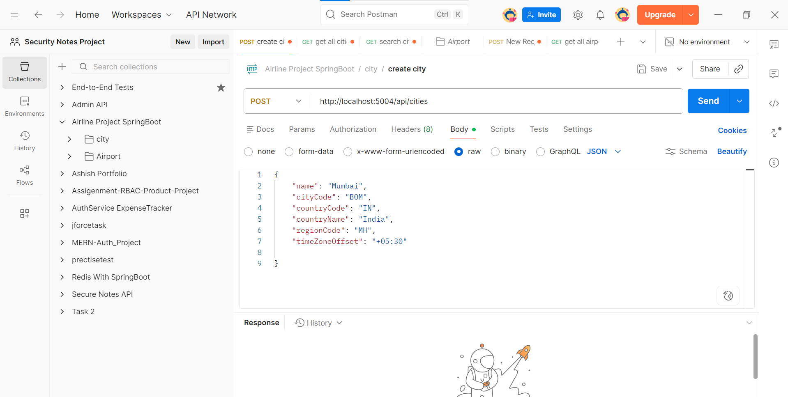
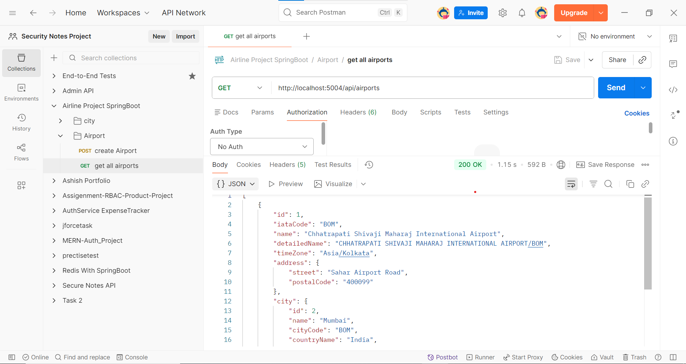
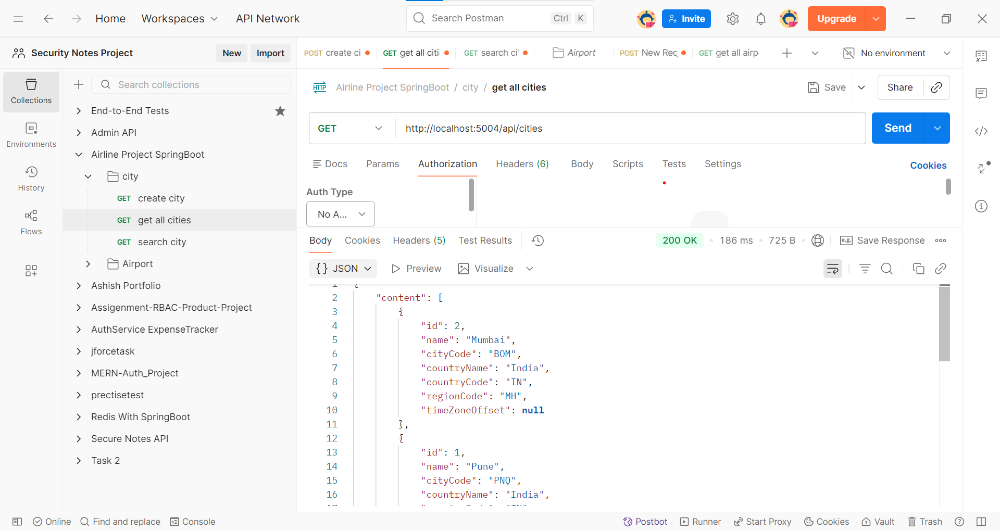
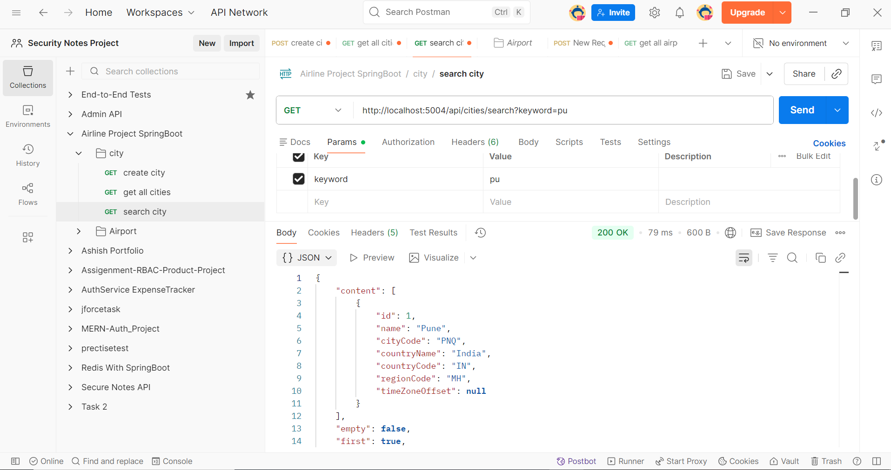

# Airline Microservices System

## Overview
This project is a backend microservices-based system developed using Spring Boot. It handles core airline functionalities such as managing cities and airports through REST APIs.

The system is designed using a multi-module architecture, making it scalable, maintainable, and production-ready.

---

## Architecture
- Microservices-based design
- Multi-module Maven project
- Separation of concerns using:
  - `cloud` (API Gateway / Config Server)
  - `common-lib` (shared utilities)
  - `services` (business logic services)

---

## Tech Stack
- Java 17
- Spring Boot
- Spring Data JPA
- MySQL
- Maven (Multi-module)
- REST APIs

---

## Key Functionalities
- Add new cities and airports
- Fetch airport details
- Retrieve list of cities
- Search city by name
- Structured API responses

## Environment Variables

Sensitive data like database passwords are managed using environment variables.

##  API Screenshots

###  Create Airport

###  Create City

###  Get Airport

### Get Cities

### Search City

