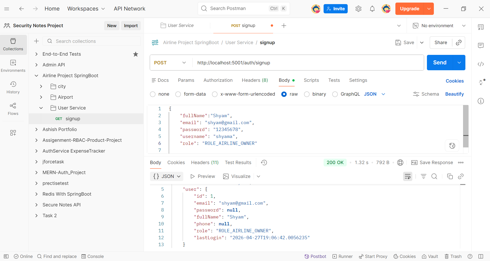
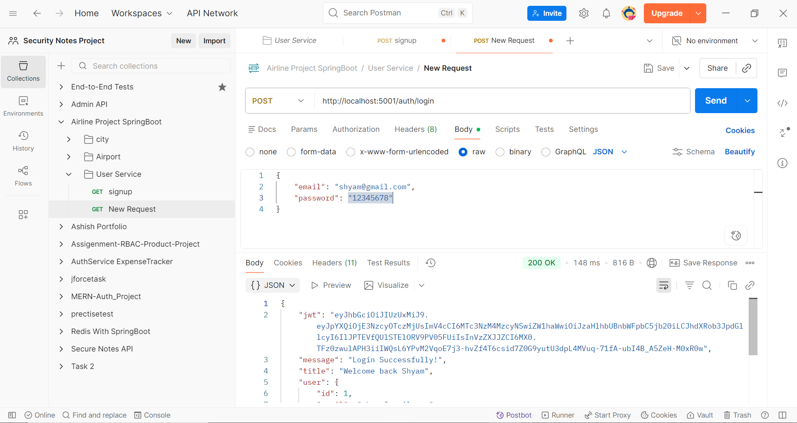
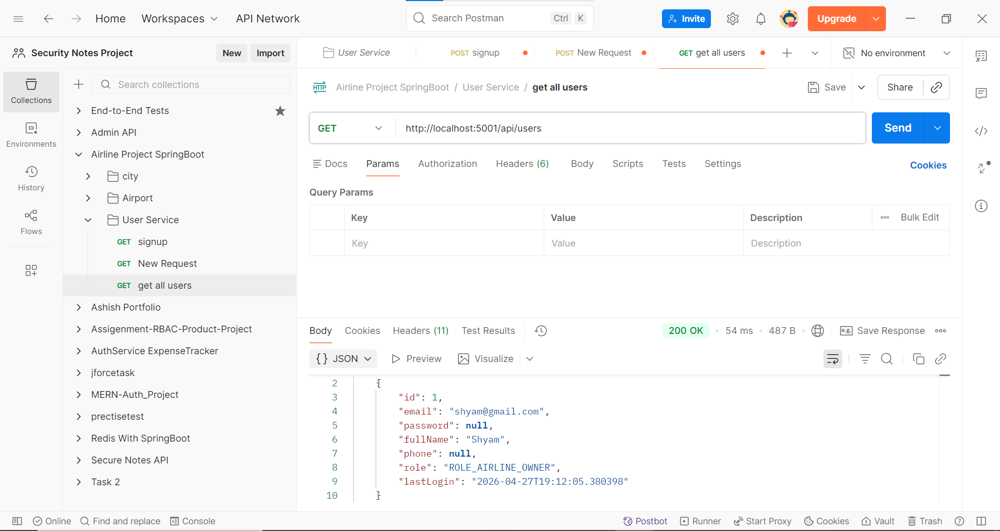
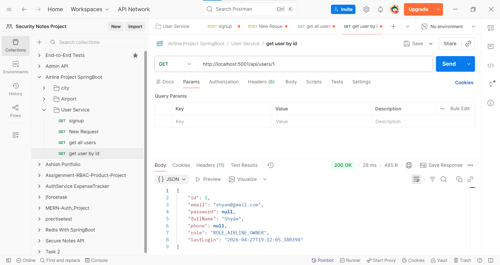

# Airline Microservices System

## Overview

This project is a backend system built using a microservices architecture for managing airline operations. Instead of a monolithic application, the system is divided into multiple independent services, each responsible for a specific functionality such as location, flight, booking, and user management.

Currently, the Location Service is fully implemented and acts as the central source of truth for all geographic data in the system.

---

## Microservices Architecture

The system follows microservices principles:

* Each service handles a single responsibility
* Services are independently deployable
* Loose coupling between services
* Each service maintains its own database

This approach improves scalability, maintainability, and fault isolation compared to monolithic architecture. 

---

## Current Status

* Location Service: Completed
* User Service: Completed
* Other Services (Flight, Booking, Pricing, etc.): In Progress

---

## Location Service

### Description

The Location Service is responsible for managing all geographic data such as cities and airports.

Other services (like flight or booking) use this service whenever they need location-related information such as:

* Airport details
* City details
* Time zones
* Airport-city relationships 

---

## Core Entities

### City

Represents a geographic location where airports exist.

Fields:

* Name
* City Code
* Country Code
* Country Name
* Region Code
* Time Zone ID

Example:

* City: Mumbai
* Code: BOM
* Country: India 

---

### Airport

Represents an airport that belongs to a city.

Fields:

* IATA Code
* Name
* Time Zone
* Address
* Geo Coordinates (Latitude, Longitude)
* City Reference

Relationship:

* One City can have multiple Airports (Many-to-One relationship) 

---

## Architecture Layers

The Location Service follows a layered architecture:

* Controller Layer
  Handles HTTP requests and responses

* Service Layer
  Defines business logic contracts

* Service Implementation Layer
  Contains actual business logic

* Repository Layer
  Interacts with the database using Spring Data JPA 

---

## Key Features

* CRUD operations for City and Airport
* Search functionality for cities
* Retrieve airports by city
* DTO-based API design (entities are not exposed directly)
* Mapper pattern for converting entities to DTOs
* Bulk data import support
* Redis caching for frequently accessed data (cities and airports) 

---

## API Endpoints

### City APIs

* POST /api/cities
  Create a new city

* POST /api/cities/bulk
  Bulk import cities

* GET /api/cities
  Retrieve all cities

* GET /api/cities/{id}
  Retrieve city by ID

* GET /api/cities/search?keyword=
  Search city by keyword

* PUT /api/cities/{id}
  Update city

* DELETE /api/cities/{id}
  Delete city
  
###  Create City

### Get Cities

### Search City

---

### Airport APIs

* POST /api/airports
  Create a new airport

* POST /api/airports/bulk
  Bulk import airports

* GET /api/airports
  Retrieve all airports

* GET /api/airports/{id}
  Retrieve airport by ID

* GET /api/airports/city/{cityId}
  Get airports by city ID

* PUT /api/airports/{id}
  Update airport

* DELETE /api/airports/{id}
  Delete airport 

---
###  Create Airport

###  Get Airport

### User APIs

* POST /auth/signup
  Register User
  

* POST /auth/login
  Login User
  
  
* GET /api/users
  Get All Users
  

* GET api/users/{id}
  Get user by id
  
 

## Tech Stack

* Java 17
* Spring Boot
* Spring Data JPA
* MySQL
* Maven (Multi-module)
* REST APIs

---

## Project Structure

microservices/
├── common-lib/
├── services/
│    ├── location-service/
│    ├── (other services - in progress)
├── pom.xml

---

## Setup Instructions

1. Clone the repository

git clone https://github.com/your-username/your-repo-name.git

2. Navigate to project directory

cd your-repo-name

3. Configure database

* Create MySQL database
* Update application.yml

4. Use environment variables for sensitive data

Example:
spring.datasource.password=${DB_PASSWORD}

5. Run the Location Service

mvn spring-boot:run

---

## Future Scope

* User Service (authentication and roles)
* Flight Service (flight scheduling and operations)
* Booking Service
* Payment Service
* API Gateway
* Service Discovery
* Inter-service communication

---

## Author

Ashish More
